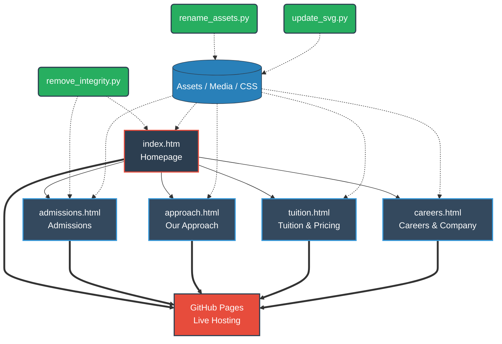

<div align="center">

# SkillSync - School for What's Ahead 🎓

[](https://webflow.com)
[](https://html.com/)
[](https://developer.mozilla.org/en-US/docs/Web/JavaScript)
[](https://www.python.org/)

A modern, responsive educational platform built for a teacher-led K–8 school model focused on mastery in reading, writing, and math.

</div>

---

## 🌟 Overview

**SkillSync** is a beautifully designed, fast, and accessible web application tailored for K-8 education systems. Originating as a Webflow project, this repository features post-processing Python scripts for asset optimization and integrity modifications, ensuring the static site runs perfectly in any environment. 

## 🏗️ Architecture & Flow

The following flowchart outlines the static site structure and asset management workflow:



## 🛠️ Technologies Used

- **HTML5 & CSS3:** Semantic markup and responsive design exported from Webflow.
- **JavaScript (ES6+):** Form handling, animations, and frontend logic.
- **Python 3:** Post-processing scripts (`rename_assets.py`, `update_svg.py`, `remove_integrity.py`) for optimizing exports and modifying HTML source integrity checks.
- **Webflow API Integration:** Webflow forms and custom Webflow scripts embedded.

## 🚀 Setup & Deployment (GitHub Pages)

This project is fully static and optimized for immediate hosting.

1. **Clone the Repository:**
   ```bash
   git clone https://github.com/Mausam5055/skillsync.git
   cd skillsync
   ```

2. **Run Post-Processing Scripts (Optional):**
   If you have updated the Webflow export, run the optimization scripts:
   ```bash
   python rename_assets.py
   python update_svg.py
   python remove_integrity.py
   ```

3. **Run Locally:**
   Serve the directory using any local web server:
   ```bash
   npx serve .
   # or
   python -m http.server 8000
   ```
   Open `http://localhost:8000` in your browser.

4. **Deploy to GitHub Pages:**
   - Push your code to your GitHub repository.
   - Go to your repository **Settings** > **Pages**.
   - Under **Build and deployment**, set the **Source** to `Deploy from a branch`.
   - Select the `main` or `master` branch and set the folder to `/ (root)`.
   - Click **Save**. Your site will be live within minutes!

## 🤝 Contributors

- **[Mausam5055](https://github.com/Mausam5055)** - *Contributor / Maintainer*

---
<div align="center">
<i>Empowering the next generation of learners.</i>
</div>
